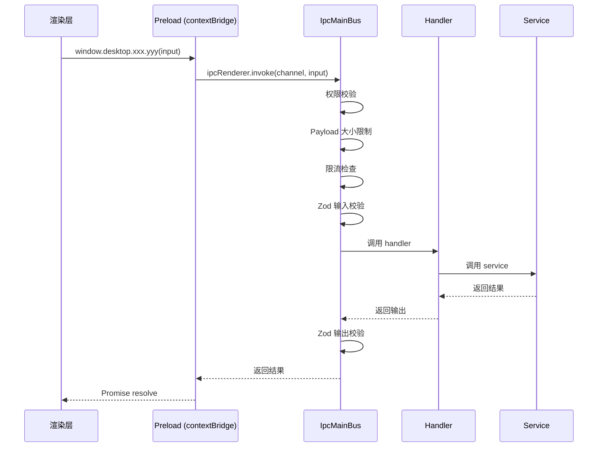

<div align="center">

# ⚡ All In One

**基于 Electron + Vue 3 + TypeScript 的多窗口桌面应用框架**

[](https://www.electronjs.org/)
[](https://vuejs.org/)
[](https://www.typescriptlang.org/)
[](https://github.com/WiseLibs/better-sqlite3)
[](https://zod.dev/)
[](https://pnpm.io/)
[](./package.json)

</div>

---

> 一个开箱即用的、采用三端严格契约（主进程 / preload / 渲染层）的 Electron 桌面应用脚手架。  
> 内置多窗口管理、IPC 总线、权限白名单、Vue 3 运行时 + 模板预编译、SQLite 持久化、Fluent UI 组件库。  
> 不依赖 Vite / Webpack，**纯 tsc + 自研打包脚本**，零运行时动态求值，CSP 友好。

---

## 📖 目录

- [✨ 特性一览](#-特性一览)
- [🧱 技术栈](#-技术栈)
- [🚀 快速开始](#-快速开始)
- [📦 常用脚本](#-常用脚本)
- [🏗 项目结构](#-项目结构)
- [🪟 多窗口系统](#-多窗口系统)
- [🔌 IPC 总线与契约](#-ipc-总线与契约)
- [🎨 渲染层](#-渲染层)
- [💾 数据库与持久化](#-数据库与持久化)
- [🔐 安全设计](#-安全设计)
- [🧪 测试](#-测试)
- [📝 代码规范](#-代码规范)
- [🤝 贡献](#-贡献)
- [📄 许可证](#-许可证)

---

## ✨ 特性一览

| 能力 | 描述 |
| --- | --- |
| 🪟 **多窗口管理** | 14 种窗口角色、单例/多实例、二次打开策略、父子窗口、状态记忆 |
| 🔌 **契约化 IPC 总线** | Zod schema 双向校验、权限分层、限流、超时、审计日志 |
| 🛡 **权限白名单** | 主进程 + 渲染层双校验，最小权限原则 |
| ⚡ **Vue 3 运行时** | CDN 全局构建 + 模板预编译，严格 CSP 下无需 `unsafe-eval` |
| 💎 **Fluent UI 组件** | 60+ 自研组件（按钮、表格、表单、菜单、命令面板…） |
| 🗄 **SQLite 持久化** | better-sqlite3 + drizzle-orm，迁移/备份/恢复一体化 |
| 🎯 **轻量 Store** | 基于 `Vue.reactive + computed`，零依赖 Pinia 风格 |
| 🔍 **类型三端共享** | 主进程 / preload / 渲染层共用同一套类型契约 |
| 🎨 **主题系统** | CSS 变量 + 多主题切换，支持减少动画偏好 |

---

## 🧱 技术栈

| 层 | 技术 |
| --- | --- |
| **运行时** | Electron 42 |
| **渲染层** | Vue 3.5（runtime global）、Tailwind CSS 4、daisyUI 5 |
| **主进程** | Node.js、better-sqlite3 12、drizzle-orm 0.45 |
| **类型与校验** | TypeScript 6（strict）、Zod 4 |
| **构建** | tsc + 自研 [build-renderer-bundle.js](./scripts/build-renderer-bundle.js) |
| **包管理** | pnpm 10 |

---

## 🚀 快速开始

### 环境要求

- Node.js ≥ 18
- pnpm ≥ 10
- Windows / macOS / Linux

### 安装

```bash
# 克隆仓库
git clone https://github.com/xuanbingBank/xuanbing.git
cd xuanbing

# 安装依赖
pnpm install
```

### 启动

```bash
# 一键启动（重编原生模块 + 构建 + 启动 Electron）
pnpm start
```

> 首次启动会自动重编 `better-sqlite3` 以匹配 Electron 的 ABI。

---

## 📦 常用脚本

| 命令 | 作用 |
| --- | --- |
| `pnpm start` | 重编原生模块 → 构建 → 启动 Electron |
| `pnpm run build` | TypeScript 编译 + 渲染层/preload bundle 打包 |
| `pnpm run typecheck` | 仅执行类型检查（`tsc --noEmit`） |
| `pnpm run test` | 重编原生模块 → 构建 → 运行全部测试 |
| `pnpm run rebuild:native:electron` | 为 Electron 重编原生模块 |
| `pnpm run rebuild:native:node` | 为 Node.js 重编原生模块（测试用） |

---

## 🏗 项目结构

```
xuanbing/
├── electron/                     # 主进程源码
│   ├── main.ts                   # 应用入口
│   ├── preload.ts                # preload 入口
│   ├── database/                 # SQLite 连接、迁移、备份恢复
│   │   ├── migrations/           # .sql 迁移文件
│   │   └── schema/               # drizzle schema 定义
│   ├── file-db/                  # .xuanbing 文件读写与校验
│   ├── ipcBus/                   # IPC 总线
│   │   ├── shared/               # 三端共享契约（contracts/schemas/types）
│   │   ├── main/                 # 主进程实现（bus/modules/permissions）
│   │   ├── preload/              # preload 实现（contextBridge 暴露）
│   │   └── renderer/             # 渲染层类型声明
│   ├── repositories/             # 数据访问层
│   ├── services/                 # 业务服务层
│   └── windows/                  # 多窗口管理系统
│       ├── main/                 # 新 WindowManager（生命周期/注册表/事件）
│       └── shared/               # 窗口配置/权限/路由/类型
├── src/
│   ├── renderer.ts               # 渲染层入口
│   └── renderer/                 # 渲染层源码
│       ├── components/           # 60+ 自研组件
│       │   ├── base/             # 基础组件（Button/Input/Modal…）
│       │   ├── business/         # 业务组件（PermissionGate…）
│       │   ├── data/             # 数据组件（Table/Pagination…）
│       │   ├── form/             # 表单组件
│       │   ├── layout/           # 布局组件
│       │   └── navigation/       # 导航组件（Menu/Breadcrumb…）
│       ├── composables/          # 20+ 组合式函数
│       ├── pages/                # 页面组件
│       ├── router/               # 自实现 HashRouter + 守卫
│       ├── services/             # IPC 客户端封装
│       ├── stores/               # 轻量 Store（Pinia 风格）
│       ├── styles/               # CSS 变量、主题、动画
│       └── utils/                # 工具函数
├── scripts/                      # 构建脚本
│   ├── build-renderer-bundle.js  # 渲染层/preload 打包器
│   └── rebuild-native.js         # 原生模块重编
├── docs/                         # 文档
├── index.html                    # 渲染层 HTML 入口
├── tsconfig.json                 # TypeScript 配置（strict）
└── package.json
```

---

## 🪟 多窗口系统

项目通过双 WindowManager 架构管理窗口：

- **新 WindowManager**（[windows/main/](./electron/windows/main/)）：负责窗口创建、生命周期、状态持久化、初始化数据传递
- **旧 WindowManager**（[ipcBus/main/window-manager.ts](./electron/ipcBus/main/window-manager.ts)）：供 IPC 总线解析 sender 与分发事件

两者在 [main.ts](./electron/main.ts) 中通过 `bridgeWindowManagers()` 自动桥接：新 WindowManager 的 `window:created` 事件会自动将窗口注册到旧 WindowManager，确保所有窗口的 IPC 请求都能正确解析角色和权限。

### 支持的窗口角色

<details>
<summary><b>14 种窗口角色（点击展开）</b></summary>

| 角色 | 用途 | 单例 |
| --- | --- | --- |
| `main` | 主窗口 | ✅ |
| `login` | 登录窗口 | ✅ |
| `settings` | 设置窗口 | ✅ |
| `about` | 关于窗口 | ✅ |
| `detail` | 详情窗口 | ❌ |
| `editor` | 编辑器窗口 | ❌ |
| `taskCenter` | 任务中心 | ✅ |
| `logViewer` | 日志查看器 | ✅ |
| `devtoolsPanel` | 开发者面板 | ❌ |
| `floatingToolbox` | 浮动工具箱 | ❌ |
| `trayPanel` | 托盘面板 | ✅ |
| `modal` | 模态窗口 | ❌ |
| `child` | 子窗口 | ❌ |
| `hiddenWorker` | 后台工作窗口 | ❌ |

</details>

### 窗口配置

每个角色的完整配置（尺寸、权限、关闭行为、二次打开策略…）集中声明在 [window-config.ts](./electron/windows/shared/window-config.ts)，启动时经 Zod 校验。

---

## 🔌 IPC 总线与契约

所有 IPC 通信通过统一契约定义，三端共享：

- **请求契约**（`requestContracts`）：定义通道、权限、输入/输出 Zod schema、超时、限流
- **事件契约**（`eventContracts`）：定义事件方向、权限、payload schema

### 流程



### 已注册的 IPC 模块

| 模块 | 通道数 | 说明 |
| --- | --- | --- |
| `app` | 1 | 应用信息 |
| `window` | 15 | 窗口控制（开/关/聚焦/列表/初始化数据…） |
| `database` | 6 | 数据库健康/统计/备份/恢复/清理 |
| `taskData` | 5 | 任务数据 CRUD |
| `setting` | 4 | 设置 CRUD |
| `task` | 2 | 后台任务启动/取消 |
| `xuanbingFile` | 7 | .xuanbing 文件导入导出 |
| `file` | 1 | 文件对话框 |

---

## 🎨 渲染层

### 路由

自实现 HashRouter（[router/index.ts](./src/renderer/router/index.ts)），支持：

- 静态路由与动态参数（`:id`）
- 通配符路由（`:pathMatch(.*)*`）
- 多层守卫：`routeExists → devOnly → routeAllowed → auth → loginRedirect → permission`

### Store

基于 `Vue.reactive + computed` 的轻量 Store 基类（[stores/base.ts](./src/renderer/stores/base.ts)），模拟 Pinia API，零依赖。

### 组件库

60+ 自研组件，Fluent UI 风格，全部 TypeScript：

<details>
<summary><b>组件清单（点击展开）</b></summary>

| 分类 | 组件 |
| --- | --- |
| **基础** | BaseAlert, BaseButton, BaseCard, BaseDrawer, BaseEmpty, BaseError, BaseLoading, BaseModal, BaseToast, FluentBadge, FluentButton, FluentCard, FluentCheckbox, FluentContextMenu, FluentDivider, FluentDrawer, FluentDropdown, FluentEmpty, FluentError, FluentIcon, FluentIconButton, FluentInput, FluentLoading, FluentModal, FluentSegmented, FluentSelect, FluentSkeleton, FluentSwitch, FluentTag, FluentTextarea, FluentToast, PageContainer |
| **业务** | PermissionGate, RouteViewWrapper, StatusBadge, WindowPermissionGate |
| **数据** | FluentDescriptionList, FluentPagination, FluentStatCard, FluentTable, FluentTableToolbar |
| **表单** | FluentFormActions, FluentFormField, FluentSearchForm, FormField, FormInput, FormSelect, FormSwitch, FormTextarea, SearchForm |
| **布局** | AppBreadcrumb, AppContent, AppHeader, AppSearchBox, AppSidebar, AppSidebarItem, AppTabs, AppThemeToggle, AppUserMenu, AppWindowControls, FluentPage |
| **导航** | FluentBreadcrumb, FluentCommandBar, FluentCommandPalette, FluentMenu, FluentMenuGroup, FluentMenuItem, FluentSubMenu, FluentTabs |
| **表格** | DataTable, DataTablePagination, DataTableToolbar |

</details>

---

## 💾 数据库与持久化

### 数据库

- **引擎**：better-sqlite3（同步 API，高性能）
- **ORM**：drizzle-orm（schema 定义 + 类型推导）
- **迁移**：SQL 文件 + 版本表（`__migrations`）

### 数据表

| 表 | 用途 |
| --- | --- |
| `app_settings` | 应用设置（命名空间隔离） |
| `window_states` | 窗口位置/大小/路由记忆 |
| `tasks` | 任务记录 |
| `task_events` | 任务事件流水 |
| `app_logs` | 应用日志 |
| `audit_logs` | 审计日志 |
| `file_assets` | 文件资产登记 |
| `sync_outbox` / `sync_inbox` | 同步队列 |

### .xuanbing 文件格式

自研的文件打包格式（[file-db/](./electron/file-db/)），支持：

- 原子写入（临时文件 + rename）
- 校验和验证
- 预览读取（不解包）
- 干跑导入（dry-run）
- 完整导入/导出

---

## 🔐 安全设计

### contextBridge 隔离

preload 通过 `contextBridge.exposeInMainWorld` 暴露最小化 API，渲染层无法直接访问 Node.js / Electron 内部 API。

### 权限分层

1. **窗口权限**：角色级白名单，控制窗口能调用哪些 IPC 通道
2. **操作权限**：跨窗口操作需额外权限（如 `window:control:any`）
3. **路由权限**：路由级白名单，控制角色能访问哪些页面

### CSP

[index.html](./index.html) 配置了严格的 Content-Security-Policy，渲染层不使用 `unsafe-eval`。Vue 模板在构建时预编译为 render 函数。

---

## 🧪 测试

```bash
pnpm run test
```

测试覆盖：

- IPC 契约与 schema 校验
- 窗口管理器
- 数据库迁移与查询
- 原生模块重编

---

## 📝 代码规范

- **TypeScript strict 模式**：全项目开启 `strict: true`
- **Zod 校验**：所有 IPC 输入/输出经 Zod schema 校验
- **最小改动原则**：修复问题时优先最小改动，避免过度工程化
- **中文注释**：所有公共 API 使用中文 JSDoc 注释

---

## 🤝 贡献

欢迎提交 Issue 和 Pull Request。

1. Fork 本仓库
2. 创建特性分支：`git checkout -b feature/amazing-feature`
3. 提交更改：`git commit -m 'feat: add amazing feature'`
4. 推送分支：`git push origin feature/amazing-feature`
5. 提交 Pull Request

### 提交规范

建议遵循 [Conventional Commits](https://www.conventionalcommits.org/)：

| 前缀 | 用途 |
| --- | --- |
| `feat` | 新功能 |
| `fix` | Bug 修复 |
| `refactor` | 重构 |
| `perf` | 性能优化 |
| `docs` | 文档 |
| `test` | 测试 |
| `chore` | 构建/工具 |

---

## 📄 许可证

[ISC License](./package.json)

---

<div align="center">

<sub>Built with ❤️ by the xuanbing team</sub>

<sub>⭐ 如果这个项目对你有帮助，欢迎点个 Star！</sub>

**[⬆ 回到顶部](#-all-in-one)**

</div>
