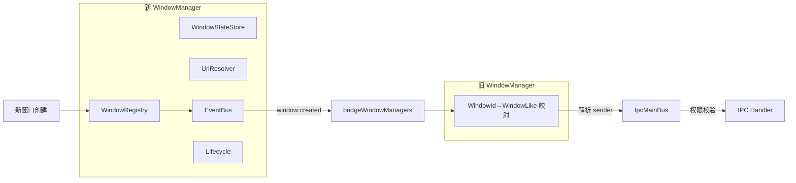
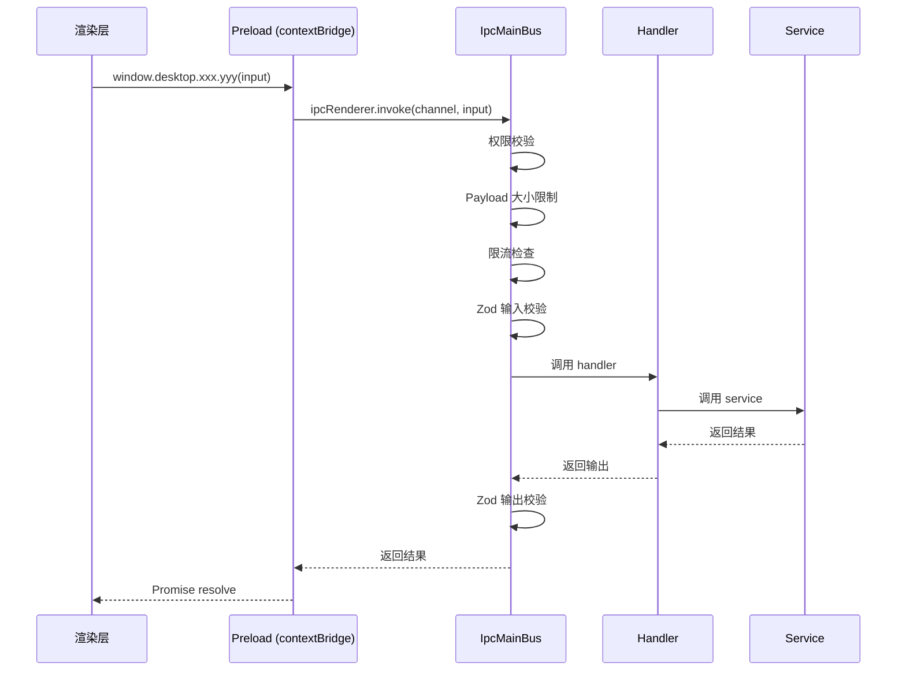
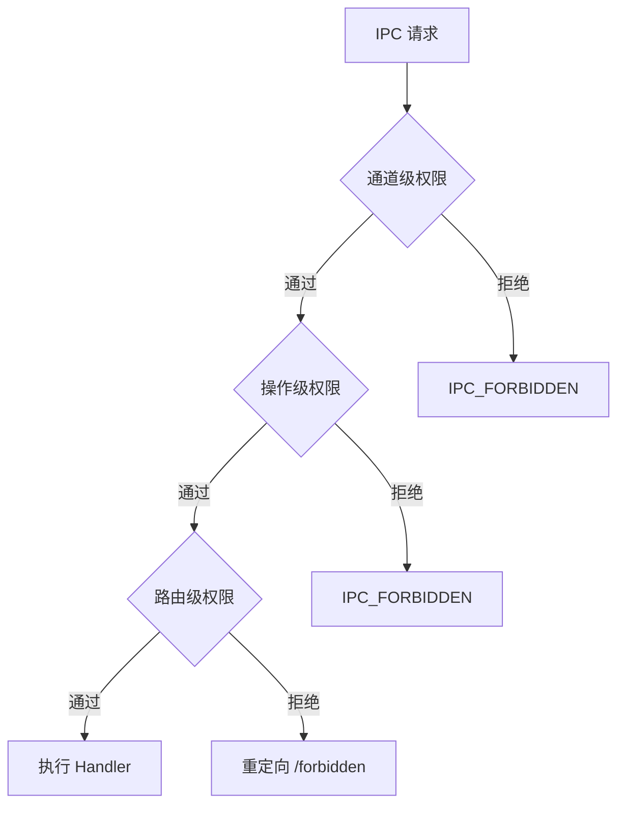

<div align="center">

# ⚡ All In One

**基于 Electron + Vue 3 + TypeScript 的多窗口桌面应用框架**

🪟 · 🔌 · 🛡 · ⚡ · 💎 · 🗄 · 🎯 · 🎨

[](https://www.electronjs.org/)
[](https://vuejs.org/)
[](https://www.typescriptlang.org/)
[](https://github.com/WiseLibs/better-sqlite3)
[](https://zod.dev/)
[](https://pnpm.io/)
[](./package.json)
[](./CONTRIBUTING.md)

<h3>
  <a href="#-快速开始">快速开始</a>
  <span> | </span>
  <a href="#-项目结构">项目结构</a>
  <span> | </span>
  <a href="#-ipc-总线与契约">IPC 契约</a>
  <span> | </span>
  <a href="#-多窗口系统">多窗口</a>
  <span> | </span>
  <a href="#-开发文档体系">开发文档</a>
  <span> | </span>
  <a href="#-贡献">贡献</a>
</h3>

</div>

---

> 💡 **一句话介绍**：一个开箱即用的 Electron 桌面应用脚手架，采用主进程 / preload / 渲染层三端严格契约，内置多窗口管理、IPC 总线、权限白名单、Vue 3 运行时 + 模板预编译、SQLite 持久化、Fluent UI 组件库。不依赖 Vite / Webpack，**纯 tsc + 自研打包脚本**，零运行时动态求值，CSP 友好。

---

## 📖 目录

- [✨ 特性一览](#-特性一览)
- [🎯 项目哲学](#-项目哲学)
- [🧱 技术栈](#-技术栈)
- [🚀 快速开始](#-快速开始)
- [📦 常用脚本](#-常用脚本)
- [🏗 项目结构](#-项目结构)
- [🪟 多窗口系统](#-多窗口系统)
- [🔌 IPC 总线与契约](#-ipc-总线与契约)
- [🎨 渲染层](#-渲染层)
- [💾 数据库与持久化](#-数据库与持久化)
- [🔐 安全设计](#-安全设计)
- [❓ FAQ](#-faq)
- [🧪 测试](#-测试)
- [📝 代码规范](#-代码规范)
- [📚 开发文档体系](#-开发文档体系)
- [🤝 贡献](#-贡献)
- [📄 许可证](#-许可证)

---

## ✨ 特性一览

| 能力 | 描述 |
| --- | --- |
| 🪟 **多窗口管理** | 14 种窗口角色、单例/多实例、二次打开策略、父子窗口、状态记忆 |
| 🔌 **契约化 IPC 总线** | Zod schema 双向校验、权限分层、限流、超时、审计日志 |
| 🛡 **权限白名单** | 主进程 + 渲染层双校验，最小权限原则 |
| ⚡ **Vue 3 运行时** | CDN 全局构建 + 模板预编译，严格 CSP 下无需 `unsafe-eval` |
| 💎 **Fluent UI 组件** | 60+ 自研组件（按钮、表格、表单、菜单、命令面板…） |
| 🗄 **SQLite 持久化** | better-sqlite3 + drizzle-orm，迁移/备份/恢复一体化 |
| 🎯 **轻量 Store** | 基于 `Vue.reactive + computed`，零依赖 Pinia 风格 |
| 🔍 **类型三端共享** | 主进程 / preload / 渲染层共用同一套类型契约 |
| 🎨 **主题系统** | CSS 变量 + 多主题切换，支持减少动画偏好 |

---

## 🎯 项目哲学

> **为什么不用 Vite / Webpack？**

本项目刻意避免了重型构建链。理由：

1. **CSP 友好** — Electron 应用常需严格 CSP，避免 `unsafe-eval`。模板预编译在构建期完成，渲染层仅加载 runtime-only Vue。
2. **零魔法** — `tsc` 产出标准 CommonJS，自研 [build-renderer-bundle.js](./scripts/build-renderer-bundle.js) 仅做依赖收集与模板预编译，无热更新、无 dev server，行为可预测。
3. **最小依赖** — 没有 `vite`、`webpack`、`esbuild`、`rollup` 等构建器及其插件生态，依赖树更小，升级更可控。

> **为什么用双 WindowManager？**

- **新 WindowManager**（[windows/main/](./electron/windows/main/)）：职责清晰，组合 registry/stateStore/urlResolver/eventBus 等模块。
- **旧 WindowManager**（[ipcBus/main/window-manager.ts](./electron/ipcBus/main/window-manager.ts)）：轻量映射表，供 IPC 总线解析 sender。
- 两者在 [main.ts](./electron/main.ts) 中通过 `bridgeWindowManagers()` 自动桥接，无需手动维护。

> **为什么契约先行？**

IPC 是 Electron 安全的核心边界。所有通道在 [contracts.ts](./electron/ipcBus/shared/contracts.ts) 集中声明，包含权限、Zod schema、超时、限流、审计标志。三端共享同一份契约，编译期与运行期双重保证类型安全。

---

## 🧱 技术栈

| 层 | 技术 |
| --- | --- |
| **运行时** | Electron 42 |
| **渲染层** | Vue 3.5（runtime global）、Tailwind CSS 4、daisyUI 5 |
| **主进程** | Node.js、better-sqlite3 12、drizzle-orm 0.45 |
| **类型与校验** | TypeScript 6（strict）、Zod 4 |
| **构建** | tsc + 自研 [build-renderer-bundle.js](./scripts/build-renderer-bundle.js) |
| **包管理** | pnpm 10 |

---

## 🚀 快速开始

### 环境要求

| 工具 | 最低版本 | 说明 |
| --- | --- | --- |
| Node.js | ≥ 18 | 推荐 LTS |
| pnpm | ≥ 10 | 包管理器 |
| 系统 | Windows / macOS / Linux | 跨平台支持 |

### 安装

```bash
# 克隆仓库
git clone https://github.com/xuanbingBank/xuanbing.git
cd xuanbing

# 安装依赖
pnpm install
```

### 启动

```bash
# 一键启动（重编原生模块 + 构建 + 启动 Electron）
pnpm start
```

> ⚠️ 首次启动会自动重编 `better-sqlite3` 以匹配 Electron 的 ABI，请耐心等待。

### 最小示例

渲染层调用主进程 IPC 的完整链路：

```typescript
// 渲染层（src/renderer/services/setting.client.ts）
import { window } from '../composables/useCurrentWindow'

// 1. 通过 preload 暴露的 desktop API 调用
const setting = await window.desktop.setting.get({
  namespace: 'app',
  key: 'theme'
})

// 2. 主进程 IPC handler（electron/ipcBus/main/modules/setting.ipc.ts）
bus.registerHandler(requestContracts[IPC_CHANNELS.settingGet], async ({ input }) => {
  return settingService.get(input.namespace, input.key)  // 经 Zod 校验后返回
})
```

---

## 📦 常用脚本

| 命令 | 作用 |
| --- | --- |
| `pnpm start` | 重编原生模块 → 构建 → 启动 Electron |
| `pnpm run build` | TypeScript 编译 + 渲染层/preload bundle 打包 |
| `pnpm run typecheck` | 仅执行类型检查（`tsc --noEmit`） |
| `pnpm run test` | 重编原生模块 → 构建 → 运行全部测试 |
| `pnpm run rebuild:native:electron` | 为 Electron 重编原生模块 |
| `pnpm run rebuild:native:node` | 为 Node.js 重编原生模块（测试用） |

---

## 🏗 项目结构

```
xuanbing/
├── electron/                     # 主进程源码
│   ├── main.ts                   # 应用入口
│   ├── preload.ts                # preload 入口
│   ├── database/                 # SQLite 连接、迁移、备份恢复
│   │   ├── migrations/           # .sql 迁移文件
│   │   └── schema/               # drizzle schema 定义
│   ├── file-db/                  # .xuanbing 文件读写与校验
│   ├── ipcBus/                   # IPC 总线
│   │   ├── shared/               # 三端共享契约（contracts/schemas/types）
│   │   ├── main/                 # 主进程实现（bus/modules/permissions）
│   │   ├── preload/              # preload 实现（contextBridge 暴露）
│   │   └── renderer/             # 渲染层类型声明
│   ├── repositories/             # 数据访问层
│   ├── services/                 # 业务服务层
│   └── windows/                  # 多窗口管理系统
│       ├── main/                 # 新 WindowManager（生命周期/注册表/事件）
│       └── shared/               # 窗口配置/权限/路由/类型
├── src/
│   ├── renderer.ts               # 渲染层入口
│   └── renderer/                 # 渲染层源码
│       ├── components/           # 60+ 自研组件
│       │   ├── base/             # 基础组件（Button/Input/Modal…）
│       │   ├── business/         # 业务组件（PermissionGate…）
│       │   ├── data/             # 数据组件（Table/Pagination…）
│       │   ├── form/             # 表单组件
│       │   ├── layout/           # 布局组件
│       │   └── navigation/       # 导航组件（Menu/Breadcrumb…）
│       ├── composables/          # 20+ 组合式函数
│       ├── pages/                # 页面组件
│       ├── router/               # 自实现 HashRouter + 守卫
│       ├── services/             # IPC 客户端封装
│       ├── stores/               # 轻量 Store（Pinia 风格）
│       ├── styles/               # CSS 变量、主题、动画
│       └── utils/                # 工具函数
├── scripts/                      # 构建脚本
│   ├── build-renderer-bundle.js  # 渲染层/preload 打包器
│   └── rebuild-native.js         # 原生模块重编
├── docs/                         # 开发文档体系（架构/IPC/窗口/数据库/渲染层/组件/构建/测试/安全/约定）
├── index.html                    # 渲染层 HTML 入口
├── tsconfig.json                 # TypeScript 配置（strict）
└── package.json
```

---

## 🪟 多窗口系统

项目通过双 WindowManager 架构管理窗口：

- **新 WindowManager**（[windows/main/](./electron/windows/main/)）：负责窗口创建、生命周期、状态持久化、初始化数据传递
- **旧 WindowManager**（[ipcBus/main/window-manager.ts](./electron/ipcBus/main/window-manager.ts)）：供 IPC 总线解析 sender 与分发事件

两者在 [main.ts](./electron/main.ts) 中通过 `bridgeWindowManagers()` 自动桥接：新 WindowManager 的 `window:created` 事件会自动将窗口注册到旧 WindowManager，确保所有窗口的 IPC 请求都能正确解析角色和权限。

### 架构图



### 支持的窗口角色

<details>
<summary><b>14 种窗口角色（点击展开）</b></summary>

| 角色 | 用途 | 单例 |
| --- | --- | --- |
| `main` | 主窗口 | ✅ |
| `login` | 登录窗口 | ✅ |
| `settings` | 设置窗口 | ✅ |
| `about` | 关于窗口 | ✅ |
| `detail` | 详情窗口 | ❌ |
| `editor` | 编辑器窗口 | ❌ |
| `taskCenter` | 任务中心 | ✅ |
| `logViewer` | 日志查看器 | ✅ |
| `devtoolsPanel` | 开发者面板 | ❌ |
| `floatingToolbox` | 浮动工具箱 | ❌ |
| `trayPanel` | 托盘面板 | ✅ |
| `modal` | 模态窗口 | ❌ |
| `child` | 子窗口 | ❌ |
| `hiddenWorker` | 后台工作窗口 | ❌ |

</details>

### 窗口配置

每个角色的完整配置（尺寸、权限、关闭行为、二次打开策略…）集中声明在 [window-config.ts](./electron/windows/shared/window-config.ts)，启动时经 Zod 校验。

---

## 🔌 IPC 总线与契约

所有 IPC 通信通过统一契约定义，三端共享：

- **请求契约**（`requestContracts`）：定义通道、权限、输入/输出 Zod schema、超时、限流
- **事件契约**（`eventContracts`）：定义事件方向、权限、payload schema

### 调用流程



### 已注册的 IPC 模块

| 模块 | 通道数 | 说明 |
| --- | --- | --- |
| `app` | 1 | 应用信息 |
| `window` | 15 | 窗口控制（开/关/聚焦/列表/初始化数据…） |
| `database` | 6 | 数据库健康/统计/备份/恢复/清理 |
| `taskData` | 5 | 任务数据 CRUD |
| `setting` | 4 | 设置 CRUD |
| `task` | 2 | 后台任务启动/取消 |
| `xuanbingFile` | 7 | .xuanbing 文件导入导出 |
| `file` | 1 | 文件对话框 |

<details>
<summary><b>📦 全部 IPC 通道清单（点击展开）</b></summary>

| 通道 | 权限 | 说明 |
| --- | --- | --- |
| `app:info.get` | `app:read` | 获取应用信息 |
| `window:open` | `window:open` | 打开窗口 |
| `window:close` | `window:close:self` | 关闭窗口 |
| `window:minimize` | `window:control:self` | 最小化 |
| `window:maximize` | `window:control:self` | 最大化 |
| `window:focus` | `window:focus` | 聚焦窗口 |
| `window:list` | `window:list` | 列出所有窗口 |
| `window:getCurrent` | `public` | 获取当前窗口信息 |
| `window:getInitPayload` | `public` | 消费初始化数据 |
| `database:getHealth` | `database:read` | 数据库健康检查 |
| `database:backup` | `database:backup` | 数据库备份 |
| `database:restore` | `database:restore` | 数据库恢复 |
| `setting:get` | `setting:read` | 读取设置 |
| `setting:set` | `setting:write` | 写入设置 |
| `taskData:list` | `taskData:read` | 任务列表 |
| `taskData:create` | `taskData:write` | 创建任务 |
| `xuanbingFile:importPackage` | `xuanbingFile:import` | 导入 .xuanbing |
| `xuanbingFile:exportPackage` | `xuanbingFile:export` | 导出 .xuanbing |
| ... | ... | 完整清单见 [contracts.ts](./electron/ipcBus/shared/contracts.ts) |

</details>

---

## 🎨 渲染层

### 路由

自实现 HashRouter（[router/index.ts](./src/renderer/router/index.ts)），支持：

- 静态路由与动态参数（`:id`）
- 通配符路由（`:pathMatch(.*)*`）
- 多层守卫：`routeExists → devOnly → routeAllowed → auth → loginRedirect → permission`

### Store

基于 `Vue.reactive + computed` 的轻量 Store 基类（[stores/base.ts](./src/renderer/stores/base.ts)），模拟 Pinia API，零依赖。

### 组件库

60+ 自研组件，Fluent UI 风格，全部 TypeScript：

<details>
<summary><b>🧩 组件清单（点击展开）</b></summary>

| 分类 | 组件 |
| --- | --- |
| **基础** | BaseAlert, BaseButton, BaseCard, BaseDrawer, BaseEmpty, BaseError, BaseLoading, BaseModal, BaseToast, FluentBadge, FluentButton, FluentCard, FluentCheckbox, FluentContextMenu, FluentDivider, FluentDrawer, FluentDropdown, FluentEmpty, FluentError, FluentIcon, FluentIconButton, FluentInput, FluentLoading, FluentModal, FluentSegmented, FluentSelect, FluentSkeleton, FluentSwitch, FluentTag, FluentTextarea, FluentToast, PageContainer |
| **业务** | PermissionGate, RouteViewWrapper, StatusBadge, WindowPermissionGate |
| **数据** | FluentDescriptionList, FluentPagination, FluentStatCard, FluentTable, FluentTableToolbar |
| **表单** | FluentFormActions, FluentFormField, FluentSearchForm, FormField, FormInput, FormSelect, FormSwitch, FormTextarea, SearchForm |
| **布局** | AppBreadcrumb, AppContent, AppHeader, AppSearchBox, AppSidebar, AppSidebarItem, AppTabs, AppThemeToggle, AppUserMenu, AppWindowControls, FluentPage |
| **导航** | FluentBreadcrumb, FluentCommandBar, FluentCommandPalette, FluentMenu, FluentMenuGroup, FluentMenuItem, FluentSubMenu, FluentTabs |
| **表格** | DataTable, DataTablePagination, DataTableToolbar |

</details>

---

## 💾 数据库与持久化

### 数据库

- **引擎**：better-sqlite3（同步 API，高性能）
- **ORM**：drizzle-orm（schema 定义 + 类型推导）
- **迁移**：SQL 文件 + 版本表（`__migrations`）

### 数据表

| 表 | 用途 |
| --- | --- |
| `app_settings` | 应用设置（命名空间隔离） |
| `window_states` | 窗口位置/大小/路由记忆 |
| `tasks` | 任务记录 |
| `task_events` | 任务事件流水 |
| `app_logs` | 应用日志 |
| `audit_logs` | 审计日志 |
| `file_assets` | 文件资产登记 |
| `sync_outbox` / `sync_inbox` | 同步队列 |

### .xuanbing 文件格式

自研的文件打包格式（[file-db/](./electron/file-db/)），支持：

- 原子写入（临时文件 + rename）
- 校验和验证
- 预览读取（不解包）
- 干跑导入（dry-run）
- 完整导入/导出

---

## 🔐 安全设计

### contextBridge 隔离

preload 通过 `contextBridge.exposeInMainWorld` 暴露最小化 API，渲染层无法直接访问 Node.js / Electron 内部 API。

### 权限分层



1. **窗口权限**：角色级白名单，控制窗口能调用哪些 IPC 通道
2. **操作权限**：跨窗口操作需额外权限（如 `window:control:any`）
3. **路由权限**：路由级白名单，控制角色能访问哪些页面

### CSP

[index.html](./index.html) 配置了严格的 Content-Security-Policy，渲染层不使用 `unsafe-eval`。Vue 模板在构建时预编译为 render 函数。

---

## ❓ FAQ

<details>
<summary><b>为什么页面打开是空白的？</b></summary>

最常见原因：Vue 模板中使用了 TypeScript 语法（如 `as` 类型断言）。Vue 编译器不识别 TS 语法，会导致编译后的 render 函数包含非法标识符，浏览器抛出 `SyntaxError`。

**解决**：模板内的表达式仅使用纯 JavaScript 语法，类型断言放到 `<script>` 部分。

</details>

<details>
<summary><b>为什么非主窗口的 IPC 调用全部失败？</b></summary>

历史问题：只有主窗口注册到了旧 WindowManager，非主窗口的 sender 无法解析，权限校验返回 `unknown-window-role`。

**已修复**：[main.ts](./electron/main.ts) 的 `bridgeWindowManagers()` 会监听新 WindowManager 的 `window:created` 事件，自动将所有窗口注册到旧 WindowManager。

</details>

<details>
<summary><b>为什么不用 Vue Router？</b></summary>

Electron 渲染层加载本地 HTML 文件（`file://` 协议），hash 路由无需服务端配合即可工作。自实现 HashRouter 体积小（~200 行），完全可控，且能精确集成多层守卫。

</details>

<details>
<summary><b>如何添加新的 IPC 通道？</b></summary>

1. 在 [contracts.ts](./electron/ipcBus/shared/contracts.ts) 添加 requestContract（含 Zod schema + 权限）
2. 在 [constants.ts](./electron/ipcBus/shared/constants.ts) 添加通道常量到 `IPC_CHANNELS`
3. 在 [window-permissions.ts](./electron/windows/shared/window-permissions.ts) 为需要的角色授予对应权限
4. 在 `electron/ipcBus/main/modules/` 下对应模块注册 handler
5. 在 [desktop-api.ts](./electron/ipcBus/preload/desktop-api.ts) 暴露给渲染层

</details>

<details>
<summary><b>如何添加新的窗口角色？</b></summary>

1. 在 [window-types.ts](./electron/windows/shared/window-types.ts) 的 `WINDOW_ROLES` 添加角色名
2. 在 [window-config.ts](./electron/windows/shared/window-config.ts) 添加完整配置（启动时 Zod 校验）
3. 在 [window-routes.ts](./electron/windows/shared/window-routes.ts) 为角色配置 `allowedRoutes`
4. 在 [window-permissions.ts](./electron/windows/shared/window-permissions.ts) 配置 `DEFAULT_WINDOW_ROLE_PERMISSIONS`

</details>

---

## 🧪 测试

```bash
pnpm run test
```

测试覆盖：

- IPC 契约与 schema 校验
- 窗口管理器
- 数据库迁移与查询
- 原生模块重编

---

## 📝 代码规范

- **TypeScript strict 模式**：全项目开启 `strict: true`
- **Zod 校验**：所有 IPC 输入/输出经 Zod schema 校验
- **最小改动原则**：修复问题时优先最小改动，避免过度工程化
- **中文注释**：所有公共 API 使用中文 JSDoc 注释

---

## 📚 开发文档体系

完整的开发文档位于 [`docs/`](./docs/README.md)，基于源码深度阅读后整理，所有结论均链接到具体代码行，便于跳转验证。

### 文档导航

| 分类 | 文档 | 内容 |
| --- | --- | --- |
| **架构** | [架构总览](./docs/architecture/overview.md) · [技术栈](./docs/architecture/tech-stack.md) · [目录结构](./docs/architecture/directory-structure.md) · [启动流程](./docs/architecture/bootstrap-flow.md) | 项目哲学、依赖选型、目录职责、bootstrap 全链路 |
| **主进程** | [入口与生命周期](./docs/main-process/entry.md) | `main.ts`/`preload.ts`/`renderer-target.ts`、单例锁、before-quit 清理 |
| **IPC 总线** | [概览](./docs/ipc-bus/overview.md) · [契约](./docs/ipc-bus/contracts.md) · [调度时序](./docs/ipc-bus/dispatch-flow.md) · [通道清单](./docs/ipc-bus/channels.md) · [权限/限流/超时/审计](./docs/ipc-bus/security.md) | 四层架构、44 通道、Zod 校验、审计日志 |
| **多窗口** | [概览](./docs/windows/overview.md) · [角色配置](./docs/windows/roles.md) · [生命周期](./docs/windows/lifecycle.md) · [Toast](./docs/windows/toast.md) | 双 WM 桥接、14 角色、17 项事件、8 位置 Toast |
| **数据库** | [概览](./docs/database/overview.md) · [迁移](./docs/database/migrations.md) · [备份恢复](./docs/database/backup-restore.md) · [表结构](./docs/database/schema.md) | WAL/PRAGMA、CRLF→LF hash、pre-restore abort |
| **.xuanbing 文件** | [格式规范](./docs/xuanbing-file/format.md) · [读写与安全](./docs/xuanbing-file/io-security.md) | magic+checksum、10MB 限制、token 防路径暴露 |
| **渲染层** | [概览](./docs/renderer/overview.md) · [路由守卫](./docs/renderer/router.md) · [Stores](./docs/renderer/stores.md) · [Composables](./docs/renderer/composables.md) · [缓存](./docs/renderer/cache.md) | HashRouter、11 Store、25 composable、三层缓存 |
| **组件库** | [概览](./docs/components/overview.md) · [权限门禁](./docs/components/permission-gates.md) | 7 分类 60+ 组件、PermissionGate vs WindowPermissionGate |
| **构建/测试** | [构建](./docs/build/overview.md) · [原生重编](./docs/build/native-rebuild.md) · [测试](./docs/testing/overview.md) | build-renderer-bundle、rebuild-native、node:test |
| **安全/约定** | [安全设计](./docs/security/overview.md) · [工程约定](./docs/conventions/constraints.md) | CSP 双层、6 条硬约束、TODO 汇总、8 条反模式 |

### 场景化阅读路径

- **新成员 Onboarding**：[架构总览](./docs/architecture/overview.md) → [启动流程](./docs/architecture/bootstrap-flow.md) → [IPC 概览](./docs/ipc-bus/overview.md) → [渲染层概览](./docs/renderer/overview.md) → [工程约定](./docs/conventions/constraints.md)
- **加 IPC 通道**：[契约系统](./docs/ipc-bus/contracts.md) → [通道清单](./docs/ipc-bus/channels.md) → [权限/限流/超时/审计](./docs/ipc-bus/security.md)
- **加窗口角色**：[角色配置](./docs/windows/roles.md) → [生命周期](./docs/windows/lifecycle.md)
- **操作数据库**：[数据库概览](./docs/database/overview.md) → [表结构](./docs/database/schema.md) → [备份恢复](./docs/database/backup-restore.md)
- **改 .xuanbing 文件**：[格式规范](./docs/xuanbing-file/format.md) → [读写与安全](./docs/xuanbing-file/io-security.md)

> ⚠️ **硬约束**：数据库恢复前备份失败必须 abort、IPC `audit:true` 必须写日志、生产环境禁 localhost、文件导入 10MB 限制、IPC 契约必须配齐 Zod+权限+限流+超时、WindowManager 必须用 `bridgeWindowManagers()` 桥接。详见 [工程约定](./docs/conventions/constraints.md)。

---

## 🤝 贡献

欢迎提交 Issue 和 Pull Request！

### 快速贡献流程

1. 🍴 Fork 本仓库
2. 🌿 创建特性分支：`git checkout -b feature/amazing-feature`
3. ✅ 提交更改：`git commit -m 'feat: add amazing feature'`
4. 📤 推送分支：`git push origin feature/amazing-feature`
5. 🎉 提交 Pull Request

### 提交规范

建议遵循 [Conventional Commits](https://www.conventionalcommits.org/)：

| 前缀 | 用途 | 示例 |
| --- | --- | --- |
| `feat` | 新功能 | `feat: 添加用户管理模块` |
| `fix` | Bug 修复 | `fix: 修复窗口聚焦失败` |
| `refactor` | 重构 | `refactor: 抽离窗口状态存储` |
| `perf` | 性能优化 | `perf: 优化 IPC 序列化` |
| `docs` | 文档 | `docs: 更新 README` |
| `test` | 测试 | `test: 补充 IPC 契约测试` |
| `chore` | 构建/工具 | `chore: 升级依赖` |

---

## 📄 许可证

[ISC License](./package.json)

---

<div align="center">

<sub> Built with ❤️ by the xuanbing team </sub>

<br/>

<sub> ⭐ 如果这个项目对你有帮助，欢迎点个 Star！ </sub>

<br/>
<br/>

<a href="https://github.com/xuanbingBank/xuanbing">🌐 GitHub</a>
&nbsp;·&nbsp;
<a href="./docs">📚 文档</a>
&nbsp;·&nbsp;
<a href="https://github.com/xuanbingBank/xuanbing/issues">🐛 报告 Bug</a>
&nbsp;·&nbsp;
<a href="https://github.com/xuanbingBank/xuanbing/issues">💡 功能建议</a>

<br/>
<br/>

<a href="https://github.com/xuanbingBank/xuanbing/stargazers">
  
</a>
&nbsp;·&nbsp;
<a href="https://github.com/xuanbingBank/xuanbing/network/members">
  
</a>
&nbsp;·&nbsp;
<a href="https://github.com/xuanbingBank/xuanbing/watchers">
  
</a>

<br/>
<br/>

**[⬆ 回到顶部](#-all-in-one)**

</div>
